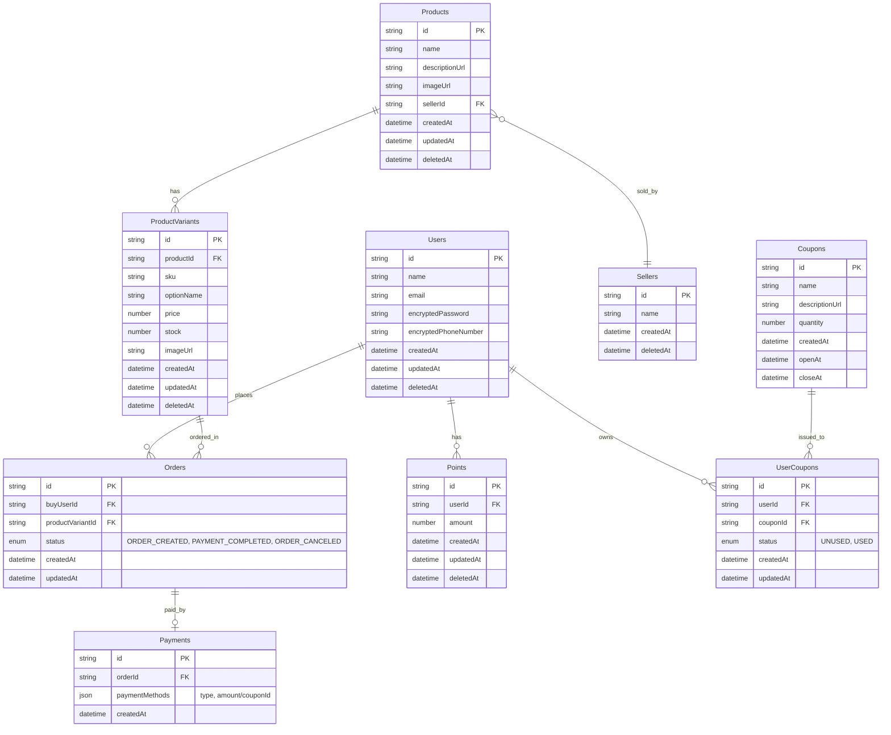

```mermaid
erDiagram
    Users ||--o{ Orders : "places"
    Users ||--o{ Points : "has"
    Users ||--o{ UserCoupons : "owns"
    
    Products ||--o{ ProductVariants : "has"
    Products }o--|| Sellers : "sold_by"
    
    ProductVariants ||--o{ Orders : "ordered_in"
    
    Orders ||--o| Payments : "paid_by"
    
    Coupons ||--o{ UserCoupons : "issued_to"
    
    Users {
        string id PK
        string name
        string email
        string encryptedPassword
        string encryptedPhoneNumber
        datetime createdAt
        datetime updatedAt
        datetime deletedAt
    }
    
    Products {
        string id PK
        string name
        string descriptionUrl
        string imageUrl
        string sellerId FK
        datetime createdAt
        datetime updatedAt
        datetime deletedAt
    }
    
    ProductVariants {
        string id PK
        string productId FK
        string sku
        string optionName
        number price
        number stock
        string imageUrl
        datetime createdAt
        datetime updatedAt
        datetime deletedAt
    }
    
    Orders {
        string id PK
        string buyUserId FK
        string productVariantId FK
        enum status "ORDER_CREATED, PAYMENT_COMPLETED, ORDER_CANCELED"
        datetime createdAt
        datetime updatedAt
    }
    
    Payments {
        string id PK
        string orderId FK
        json paymentMethods "type, amount/couponId"
        datetime createdAt
    }
    
    Sellers {
        string id PK
        string name
        datetime createdAt
        datetime deletedAt
    }
    
    Points {
        string id PK
        string userId FK
        number amount
        datetime createdAt
        datetime updatedAt
        datetime deletedAt
    }
    
    Coupons {
        string id PK
        string name
        string descriptionUrl
        number quantity
        datetime createdAt
        datetime openAt
        datetime closeAt
    }
    
    UserCoupons {
        string id PK
        string userId FK
        string couponId FK
        enum status "UNUSED, USED"
        datetime createdAt
        datetime updatedAt
    }
```