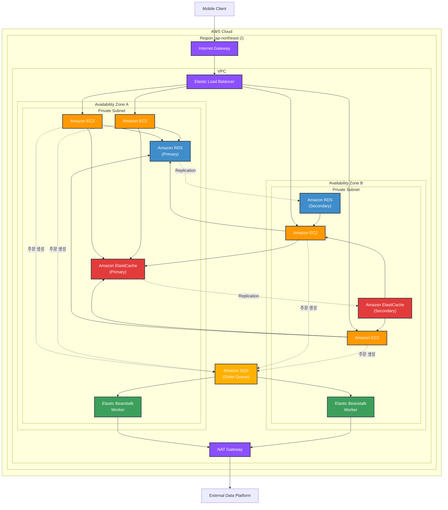

# 인프라 구성도

# 구성 요소 설명

- EC2 (Elastic Compute Cloud)
사용자의 요청을 처리하는 서버 인스턴스. 애플리케이션 로직을 실행하며, 2개의 가용 영역(AZ)에 각각 2개씩 총 4개의 인스턴스로 구성되어 고가용성을 보장합니다.

- ALB (Application Load Balancer)
사용자의 요청을 여러 Target(서버 인스턴스)에 고루 분산하는 역할. Layer 7(애플리케이션 계층)에서 동작하며, HTTP/HTTPS 트래픽을 지능적으로 라우팅하고 Health Check를 통해 정상 인스턴스로만 트래픽을 전달합니다.

- VPC (Virtual Private Cloud)
AWS 클라우드 내 논리적으로 격리된 네트워크 공간. Private Subnet을 통해 EC2, RDS, ElastiCache 등의 리소스를 외부로부터 보호하며, 보안 그룹과 네트워크 ACL로 트래픽을 제어합니다.

- ASG (Auto Scaling Group)
트래픽 패턴에 따라 EC2 인스턴스의 수를 자동으로 조절하는 서비스. CPU 사용률, 네트워크 트래픽 등의 지표를 기반으로 스케일 아웃/인을 수행하여 비용 효율성과 가용성을 동시에 확보합니다.

- RDS (Relational Database Service)
관리형 관계형 데이터베이스 서비스. Primary-Secondary 구조로 Multi-AZ 배포되어 데이터 내구성과 고가용성을 제공합니다. 자동 백업, 패치 관리, 장애 조치(Failover) 기능을 지원합니다.

- ElastiCache
인메모리 캐싱 서비스(Redis 또는 Memcached). 자주 조회되는 데이터를 캐싱하여 데이터베이스 부하를 줄이고 응답 속도를 개선합니다. Primary-Secondary 복제를 통해 데이터 가용성을 보장합니다.
  - **활용 사례**: Redis Sorted Set을 사용하여 최근 3일 내 구매 상위 5개 상품을 실시간으로 집계 및 조회. 구매 발생 시 ZINCRBY로 점수를 증가시키고, ZREVRANGE로 상위 랭킹을 조회하여 빠른 응답 속도(O(log N))를 제공합니다.

- SQS (Simple Queue Service)
완전 관리형 메시지 큐 서비스. 주문 생성 시 주문 상세 정보를 큐에 적재하여 비동기 처리를 지원합니다. 메시지 지속성을 보장하며, 처리 실패 시 재시도 및 Dead Letter Queue를 통한 에러 핸들링이 가능합니다.

- Elastic Beanstalk Worker
SQS 큐에서 메시지를 자동으로 폴링하고 처리하는 관리형 워커 환경. 각 가용 영역에 배포되어 고가용성을 보장하며, 메시지 처리 실패 시 자동 재시도를 수행합니다. 애플리케이션 코드를 실행하여 주문 정보를 외부 데이터 플랫폼으로 전송하는 역할을 담당합니다.

- NAT Gateway
Private Subnet의 리소스가 외부 인터넷으로 아웃바운드 통신을 할 수 있도록 하는 관리형 NAT 서비스. Elastic Beanstalk Worker가 외부 데이터 플랫폼으로 주문 정보를 전송할 때 사용됩니다.
